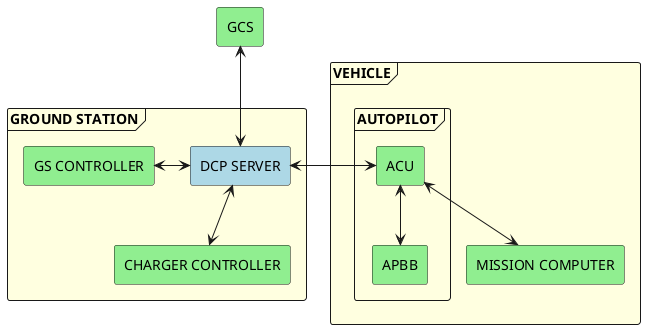

# **1. ZAD Haberleşme Mimarisi**

# **2. ZAD Telemetri ve Komut Mesajları**

|          **Mesaj İsmi**         | **Mesaj ID** | **Kaynak** | **Durak** | **Veri Boyutu** | **Frekans** |
|:-------------------------------:|:------------:|:----------:|:---------:|:---------------:|:-----------:|
| [UAV Heartbeat](#uav-heartbeat) |    0x1000    |     UAV    |    GCS    |      4byte      |     10Hz    |
| [GCS Heartbeat](#gcs-heartbeat) |    0x1001    |     GCS    |    UAV    |      4byte      |     10Hz    |

## **UAV Heartbeat**

## **GCS Heartbeat**
